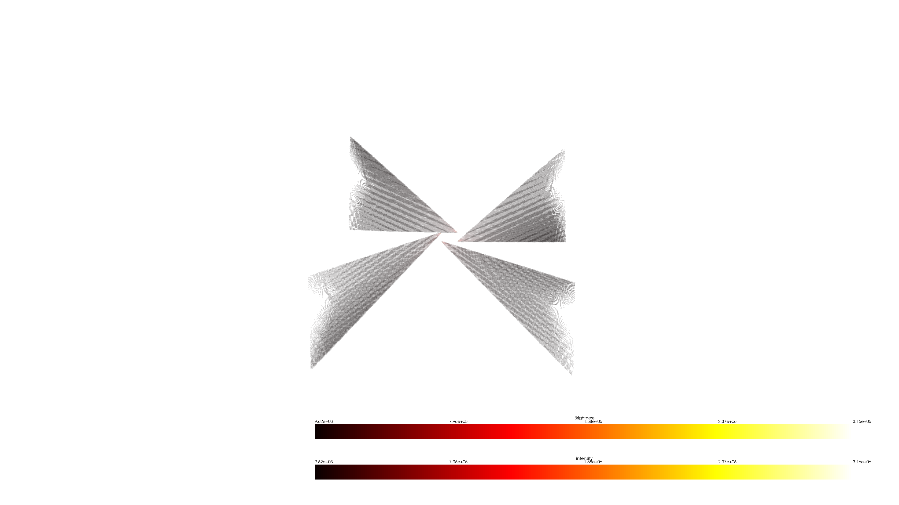

# Pixeltovoxelprojector in Rust
Pixel To Voxel Projection implementation in Rust based from the [Pixel to voxel Projection by ConsistentlyInconsistentYT](https://github.com/ConsistentlyInconsistentYT/Pixeltovoxelprojector)

---
[](#)


# Screenshots
## Rust Implementation

<table>
<tr>
<td></td>
<td></td>
</tr>
</table>

---

## Original C/C++ Implementation

<table>
<tr>
<td></td>
<td></td>
</tr>
</table>

---

As seen, there is no difference between both implementations except the random noise natively generated by both codes. What makes the Rust implementation better is the processing velocity. According to my own tests, **which please consider carefully**, by timing the frame processing, Rust velocity improved by at least 50%.

# Installation
```powershell
cargo build --release
```
## Usage
```powershell
.\PixelToVoxelInRust.exe <metadata.json> <image_folder> <output_voxel_bin>
```
