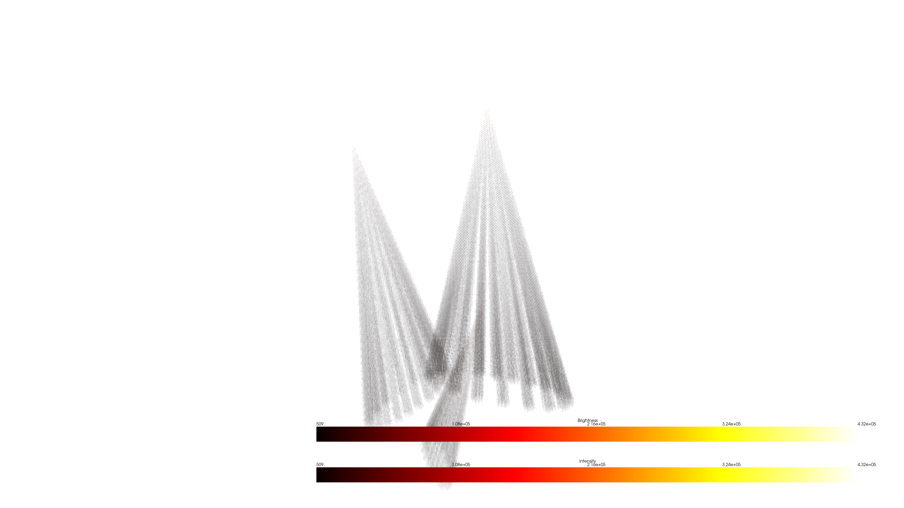
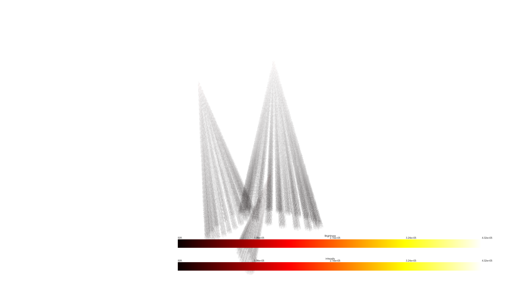
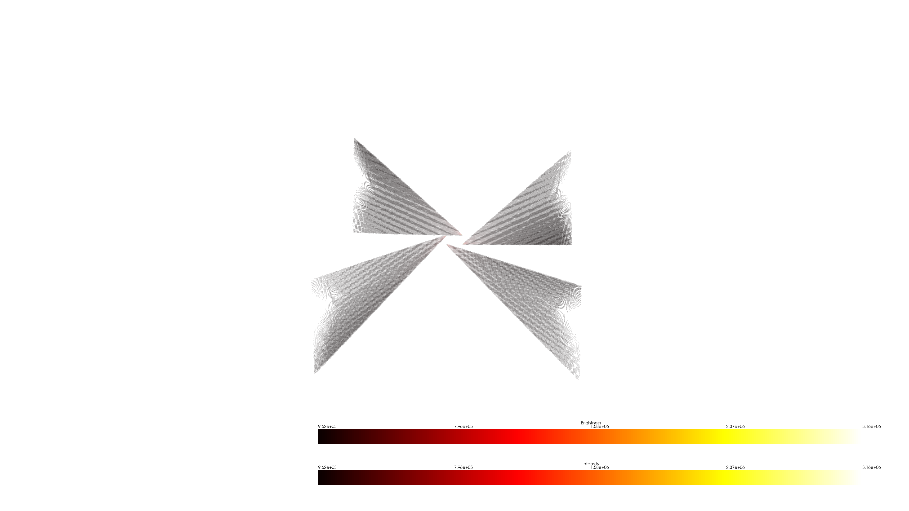

# Pixeltovoxelprojector in Rust
Pixel To Voxel Projection implementation in Rust based from the [Pixel to voxel Projection by ConsistentlyInconsistentYT](https://github.com/ConsistentlyInconsistentYT/Pixeltovoxelprojector)

---
[](#)


# Screenshots
## Rust Implementation

<table>
<tr>
<td></td>
<td></td>
</tr>
</table>

---

## Original C/C++ Implementation

<table>
<tr>
<td></td>
<td></td>
</tr>
</table>

---

As seen, there is no difference between both implementations except the random noise natively generated by both codes. What makes the Rust implementation better is the processing velocity. According to my own tests, **which please consider carefully**, by timing the frame processing, Rust velocity improved by at least 50%.

# Compilation
```powershell
cargo build --release
```
## Usage
```powershell
.\PixelToVoxelInRust.exe <metadata.json> <image_folder> <output_voxel_bin>
```

# Sparse Map Version
## Compilation
```powershell
cd sparse-map
cd rust
cargo build --release
```
## Usage
```powershell
.\PixelToVoxelInRust.exe <metadata.json> <image_folder> <sparse_map output_voxel_bin>
```
## For visualization
```powershell
python3 translate.py -o <voxel_grid.bin> --orientation xyz <sparse_map output_voxel_bin>
python3 voxelmotionviewer.py
```

# How to test?
In the test_data folder there is a compressed .tar.xz file containing around 540 frames from 4 cameras (135 frames per camera) and a properly adjusted `frame_metadata.json` compatible with both the **rust** and **original C++ code**. Output will be almost the same as there are small differences due to how its built but essentially the rays will be pointing at the same point.
